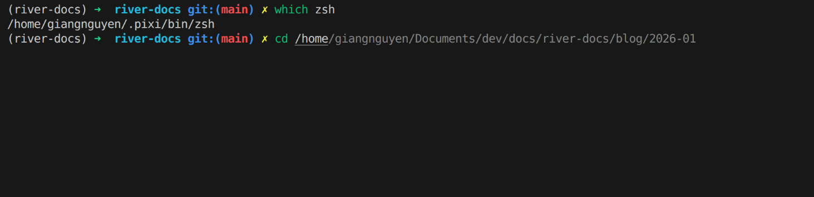

Tired of basic Bash prompts and repetitive typing? Discover how upgrading to Zsh (Z Shell) can transform your terminal experience with smart autocomplete, plugins, and beautiful themes. **Install it without admin access using Pixi!**

<!-- truncate -->

In this guide, we'll cover **Pixi-based installation** (no sudo required!), configuring Oh My Zsh, essential plugins, and developer workflows.

**What you'll learn:**
- Why Zsh is better than Bash for interactive use
- **Install Zsh with Pixi** - No admin permissions needed
- Essential plugins: autosuggestions, syntax highlighting, fzf
- Beautiful themes with Powerlevel10k
- Developer workflows: Git integration and Docker aliases

After completing this setup, you will enjoy:
- **Admin-free installation:** Works on any system including HPC clusters
- **Instant Git awareness:** See your Git branch and status in your prompt
- **Effortless command recall:** Quick history search and autocomplete



## 1. Why Upgrade from Bash to Zsh?

**Zsh (Z Shell)** is a powerful shell designed for interactive use that extends Bash with:
- **Smart tab completion** - Context-aware suggestions for commands, files, and arguments
- **Spelling correction** - Automatically suggests corrections for typos
- **Plugin ecosystem** - Plugins for Git, Docker, Python, and more
- **Beautiful themes** - Customizable prompts with Git status and system info
- **Improved history** - Shared history across sessions, better search
- **Advanced globbing** - Recursive pattern matching like `**/*.txt`

**Bottom line:** For daily interactive terminal work, Zsh is a massive upgrade. For scripts, stick with Bash for portability.

---

## 2. Installation: Getting Zsh with Pixi (No Admin Required!)

**The Best Way:** Use **Pixi global install** to install Zsh without needing sudo or admin access. This works on Linux, macOS, WSL, and **HPC clusters**.

### 2.1. Prerequisites

Before installing Zsh with Pixi:

1. **Pixi installed** - See [Pixi - New Conda-Based Era](/blog/pixi-is-new-conda-based-era) for setup
2. **No admin/sudo needed** ✨

**Verify Pixi is ready:**
```bash
pixi --version
# Should output: pixi X.X.X
```

### 2.2. Install Zsh Globally with Pixi (One Command!)

The simplest way - just one command:

```bash
# Install Zsh globally from conda-forge
pixi global install zsh --channel conda-forge
```

**That's it!** 🎉

### 2.3. Reload Terminal and Use Zsh

After installation, simply **open a new terminal** or reload your current one:

```bash
# Option 1: Open a new terminal window
# Close current terminal and open a new one

# Option 2: Reload current terminal
exec bash

# Then verify Zsh is available
zsh --version

# Check where it's installed
which zsh
# Output: /home/username/.pixi/bin/zsh

# Launch Zsh
zsh
```

**That's all you need!** Pixi automatically adds `~/.pixi/bin` to your PATH in new terminals.

### 2.4. Update or Reinstall Zsh

Keep Zsh up-to-date with Pixi:

```bash
# Update Zsh to latest version
pixi global upgrade zsh

# Reinstall with specific version
pixi global install zsh==5.9 --channel conda-forge --force

# List all globally installed packages
pixi global list

# Check Zsh version
zsh --version
```

### 2.5. Why Pixi Global Install for Zsh?

✅ **One-line installation** - No projects, no setup  
✅ **No admin/sudo required** - Install in user home  
✅ **Auto-available** - Just reload terminal, no PATH export needed  
✅ **Reproducible** - Same Zsh version across machines  
✅ **Isolated** - Won't affect system Zsh  
✅ **HPC-friendly** - Works on restricted clusters  
✅ **Easy updates** - `pixi global upgrade`  
✅ **conda-forge channel** - Best quality packages

---

## 3. Oh My Zsh: The Ultimate Configuration Framework

Now that you have Zsh installed via Pixi, let's add **Oh My Zsh** for easy management of plugins and themes.

### 3.1. What is Oh My Zsh?

[**Oh My Zsh**](https://ohmyz.sh/) is an open-source framework for managing Zsh configuration. It provides:
- 300+ plugins (Git, Docker, Python, Node, kubectl, etc.)
- 150+ themes (beautiful, customizable prompts)
- Auto-update system
- Easy configuration via `.zshrc` file

**Why use Oh My Zsh?**
- No need to write complex Zsh configs from scratch
- Community-maintained plugins and themes
- Works across Linux, macOS, and WSL

### 3.2. Install Oh My Zsh

```bash
# Install via curl
sh -c "$(curl -fsSL https://raw.githubusercontent.com/ohmyzsh/ohmyzsh/master/tools/install.sh)"

# Or via wget
sh -c "$(wget -O- https://raw.githubusercontent.com/ohmyzsh/ohmyzsh/master/tools/install.sh)"
```

**What happens:**
1. Creates `~/.oh-my-zsh/` directory
2. Backs up existing `~/.zshrc` to `~/.zshrc.pre-oh-my-zsh`
3. Creates a new `~/.zshrc` with default Oh My Zsh configuration
4. Sets Zsh as default shell (if not already)

**Verify installation:**
```bash
# Open a new terminal (or run)
exec zsh

# You should see a colorful prompt with Oh My Zsh
```

### 3.3. Understanding the .zshrc File

The `~/.zshrc` file is Zsh's configuration file (like `.bashrc` for Bash):

```bash
# Open in your favorite editor
nano ~/.zshrc
# or
vim ~/.zshrc
# or
code ~/.zshrc  # VS Code
```

**Key sections in `.zshrc`:**
```bash
# Path to Oh My Zsh installation
export ZSH="$HOME/.oh-my-zsh"

# Theme configuration
ZSH_THEME="robbyrussell"

# Plugins to load
plugins=(git)

# Load Oh My Zsh
source $ZSH/oh-my-zsh.sh

# Your custom aliases and functions go below
```

**Apply changes:**
```bash
# After editing .zshrc, reload configuration
source ~/.zshrc
```

---

## 4. Essential Plugins for Productivity

### 4.1. Core Built-in Plugins

Oh My Zsh includes essential plugins. Enable Git, Docker, and history plugins in `~/.zshrc`:

```bash
plugins=(
  git              # Git aliases: gst, ga ., gcmsg, gp, gl, glol
  docker           # Docker aliases: dps, di, dstop
  history          # h, hsi "keyword"
)
```

**Reload:**
```bash
source ~/.zshrc
```

### 4.2. Essential External Plugins

Three essential external plugins dramatically improve your Zsh experience:

#### 1. **zsh-autosuggestions** - History-based Autocomplete

Shows suggestions from history as you type (in gray). Press → to accept.

```bash
git clone https://github.com/zsh-users/zsh-autosuggestions ${ZSH_CUSTOM:-~/.oh-my-zsh/custom}/plugins/zsh-autosuggestions

# Add to ~/.zshrc plugins
plugins=(... zsh-autosuggestions)
source ~/.zshrc
```

#### 2. **zsh-syntax-highlighting** - Live Command Validation

Highlights commands: green (valid), red (invalid) as you type.

```bash
git clone https://github.com/zsh-users/zsh-syntax-highlighting.git ${ZSH_CUSTOM:-~/.oh-my-zsh/custom}/plugins/zsh-syntax-highlighting

# Add to ~/.zshrc plugins (must be LAST)
plugins=(... zsh-syntax-highlighting)
source ~/.zshrc
```

#### 3. **fzf** - Fuzzy Finder

Interactive command history and file search.

```bash
git clone --depth 1 https://github.com/junegunn/fzf.git ~/.fzf
~/.fzf/install

# Use:
Ctrl+R  # Search history
Ctrl+T  # Search files
Alt+C   # Change directory
```

### 4.3. Complete Plugin Setup

```bash
# Edit ~/.zshrc
plugins=(
  git
  docker
  history
  zsh-autosuggestions
  zsh-syntax-highlighting
)

source ~/.zshrc
```

---

## 5. Themes: Beautiful Prompts

### 5.1. Powerlevel10k (Recommended)

[**Powerlevel10k**](https://github.com/romkatv/powerlevel10k) is the most popular Zsh theme with Git status, Python version, and interactive configuration.

```bash
# Install
git clone --depth=1 https://github.com/romkatv/powerlevel10k.git ${ZSH_CUSTOM:-$HOME/.oh-my-zsh/custom}/themes/powerlevel10k

# Set in ~/.zshrc
ZSH_THEME="powerlevel10k/powerlevel10k"

# Reload - configuration wizard will launch
source ~/.zshrc
```

**Result - shows:**
```bash
┌──(user@hostname)-[~/my-repo]-[main ✓]-[🐍 3.11.4]
└─$ 
```

- `main ✓` - Git branch with status
- `🐍 3.11.4` - Active Python version
- Git icons: `✓` (clean), `!` (changes), `+` (staged)

**Reconfigure anytime:**
```bash
p10k configure
```

---

## 6. Developer Workflows and Customization

### 6.1. Git Integration

With Oh My Zsh's Git plugin and Powerlevel10k theme, you get:

**Git aliases (from `git` plugin):**
```bash
# Common commands
gst       # git status
ga .      # git add .
gcmsg     # git commit -m "message"
gp        # git push
gl        # git pull
gco       # git checkout
gcb       # git checkout -b (new branch)
glog      # git log --oneline --graph
```

**Git status in prompt:**
```bash
# Your prompt shows:
~/my-repo (main ✓)      # Clean repo
~/my-repo (main !)      # Uncommitted changes
~/my-repo (feat/new-feature +) # Staged changes
```

**View all Git aliases:**
```bash
alias | grep git
```

### 6.2. Docker Workflows

Enable `docker` and `docker-compose` plugins:

```bash
# ~/.zshrc
plugins=(... docker docker-compose)
```

**Docker aliases:**
```bash
# Common commands
dps       # docker ps
di        # docker images
dex       # docker exec -it
dstop     # docker stop
drm       # docker rm
drmf      # docker rm -f
```

**Docker autocomplete:**
```bash
docker <TAB>              # Shows all commands
docker run <TAB>          # Shows images
docker exec <TAB>         # Shows running containers
```

---

## 7. Sync Zsh Config: Desktop to HPC via GitHub

Use a dotfiles GitHub repository to keep your Zsh configuration synchronized across your local desktop and HPC cluster. Since HPC clusters typically have shared home directories, your config automatically works everywhere.

### 7.1. Create a Dotfiles Repository

**On your desktop:**

```bash
# Create dotfiles directory
mkdir -p ~/dotfiles
cd ~/dotfiles

# Initialize Git
git init

# Copy your Zsh config
cp ~/.zshrc zshrc

# Add and commit
git add zshrc
git commit -m "Initial commit: Zsh config"

# Create GitHub repo and push
git remote add origin https://github.com/yourusername/dotfiles.git
git branch -M main
git push -u origin main
```

### 7.2. Link Config on Desktop and HPC

**On desktop or HPC (after cloning):**

```bash
# Clone dotfiles
git clone https://github.com/yourusername/dotfiles.git ~/dotfiles

# Create symlink to Zsh config
rm ~/.zshrc  # Backup original if needed
ln -s ~/dotfiles/zshrc ~/.zshrc

# Verify
cat ~/.zshrc | head -5
```

### 7.3. HPC-Specific Workflow

Since most HPC clusters mount home directories as NFS, your `~/dotfiles` repo is automatically available on compute nodes.

```bash
# On HPC login node
git clone https://github.com/yourusername/dotfiles.git ~/dotfiles
ln -s ~/dotfiles/zshrc ~/.zshrc

# Your config is now available on all compute nodes via shared home!
# Launch Zsh on any node:
zsh
```

**Benefits for HPC:**
- One config file for all login and compute nodes
- No need to configure Zsh on each machine
- Easy to update: just `git pull` in `~/dotfiles`

### 7.4. Update Config Across All Machines

```bash
# Edit ~/.zshrc on desktop
nano ~/.zshrc

# Commit and push changes
cd ~/dotfiles
git add zshrc
git commit -m "Update: Add new alias"
git push

# On HPC, pull latest config
cd ~/dotfiles
git pull

# Changes take effect in new terminal session
exec zsh
```

---

## 8. Next Steps

Drop a comment below or reach out on [GitHub](https://github.com/nttg8100)! Share your `.zshrc` configurations and favorite plugins.

**Related Posts:**
- [Pixi - New Conda-Based Era](/blog/pixi-is-new-conda-based-era) - Modern package management (no admin required!)
- [Containers on HPC: Docker to Singularity](/blog/containers-hpc-docker-singularity-apptainer) - Reproducible environments on clusters
- [Building a Reproducible GATK Variant Calling Bash Workflow with Pixi (Part 1)](/blog/gatk-variant-calling-bash-workflow-pixi-part1) - Real-world Pixi + HPC example
- [Building a Slurm HPC Cluster (Part 1)](/blog/how-to-build-slurm-hpc-part-1) - HPC infrastructure guide
