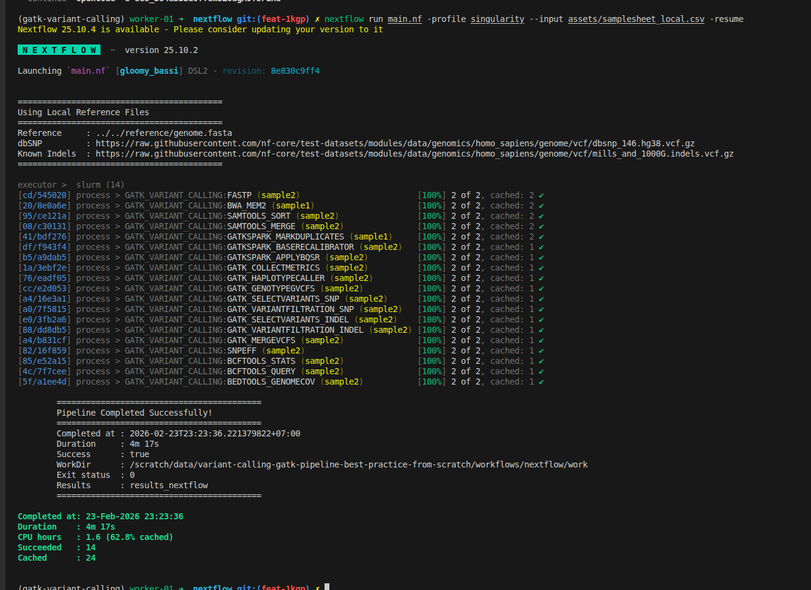
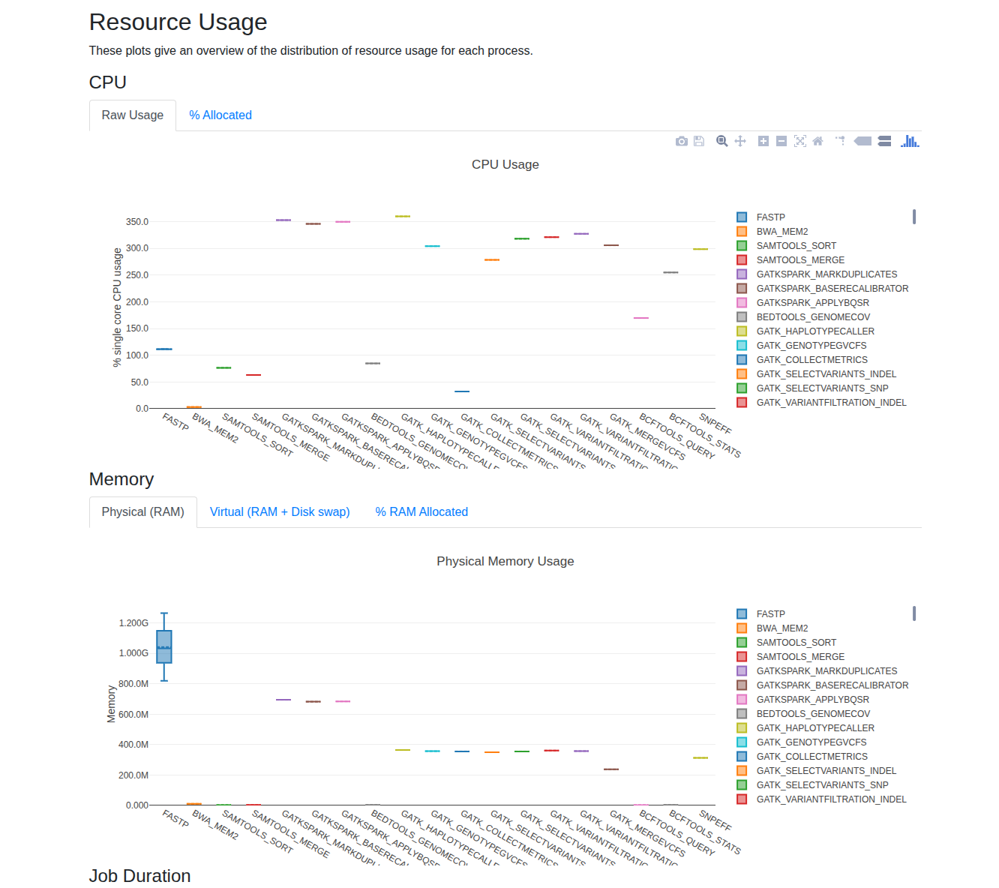

In [Part 1](/blog/gatk-variant-calling-bash-workflow-pixi-part1), we built a solid bash baseline. In [Part 2](/blog/gatk-variant-calling-bash-to-nextflow-validation-part2), we migrated to Nextflow with MD5 validation. Now it's time to deploy on **HPC clusters with SLURM and optimize for production scale**: configure executors for small clusters, tune resources per tool, replace bottleneck steps with faster alternatives (fastp + Spark-GATK), and demonstrate scaling from 1 to 100 samples. This practical guide will help you run your variant calling pipeline efficiently on real HPC infrastructure.

<!-- truncate -->

> **📁 Repository**: All code from this tutorial lives in the [variant-calling-gatk-pipeline-best-practice-from-scratch](https://github.com/nttg8100/variant-calling-gatk-pipeline-best-practice-from-scratch) repository. By the end of Part 3, you'll have SLURM profiles, optimized modules, and production-ready configurations ready to deploy on your cluster.

---

## 1. Introduction: From Proof-of-Concept to Production

### 1.1. The Series So Far

**Part 1: Bash Baseline**
- Built a 16-step GATK variant calling pipeline in bash
- Suitable for 1-10 samples, 50+ minutes runtime per sample
- Academic proof-of-concept approach

**Part 2: Nextflow Migration**
- Migrated all 16 steps to Nextflow with Singularity containers
- Validated scientific equivalence with MD5 checksums
- Single sample: 3 minutes 38 seconds (local execution)
- Foundation for parallelization

**Part 3: Production Scale (This Post)**
- Deploy on SLURM clusters (small to large)
- Optimize resource allocation per tool
- Replace slow tools with faster alternatives
- Scale from 1 → 10 → 100 samples progressively
- **Expected result**: 2-3 hours for 100 samples vs. 3.5 days with bash

### 1.2. What You'll Learn

After this blog, you'll be able to:
- ✅ Configure Nextflow SLURM executor for different cluster sizes
- ✅ Tune CPU, memory, and walltime per GATK tool
- ✅ Replace FastQC+TrimGalore with **fastp** (2.5x faster)
- ✅ Deploy **Spark-based GATK tools** for parallelization
- ✅ Scale progressively: 1 sample → 10 samples → 100 samples
- ✅ Monitor execution and troubleshoot common issues
- ✅ Achieve 50-60% performance improvement over Part 2

### 1.3. Prerequisites

This blog builds on Parts 1 and 2. If you're new to this series, start here:

1. **[Part 1: Bash GATK Pipeline with Pixi](/blog/gatk-variant-calling-bash-workflow-pixi-part1)** - Understand the 16-step workflow
2. **[Part 2: Bash to Nextflow Migration](/blog/gatk-variant-calling-bash-to-nextflow-validation-part2)** - Know how to run Nextflow pipeline
3. **[Building a Slurm HPC Cluster Part 1](/blog/how-to-build-slurm-hpc-part-1)** - SLURM cluster basics
4. **[Building a Slurm HPC Cluster Part 2](/blog/how-to-build-slurm-hpc-part-2)** - Multi-node clusters with Ansible
5. **[Building a Slurm HPC Cluster Part 3](/blog/how-to-build-slurm-hpc-part-3)** - Administration and best practices
6. **[Containers on HPC: From Docker to Singularity and Apptainer](/blog/containers-hpc-docker-singularity-apptainer)** - Container setup on HPC

### 1.4. Cluster Assumptions

This guide assumes you have:
- A SLURM cluster with 2-10+ nodes (examples provided for different scales)
- Access to shared storage (NFS or similar)

---
### 1.5. Supporting Multiple Raw Files Per Sample

In many sequencing projects, a single biological sample may be sequenced across multiple lanes or runs, resulting in several pairs of FASTQ files per sample. 

Our previous pipeline does not support multiple lanes per sample, here we have a minor update for this. To accommodate this, update your sample sheet to include a `lane` column,
so each row represents a unique combination of sample and sequencing lane. This allows the pipeline to treat each lane as a sub-sample for alignment, which can then be merged into a single BAM file per sample.

#### Samtools sort
Aligned bam files of a sample are sorted
```bash
process SAMTOOLS_SORT {
    tag "$meta.id"
    label 'process_medium'
    
    
    container 'quay.io/biocontainers/samtools:1.17--hd87286a_2'
    
    input:
    tuple val(meta), path(bam)
    
    output:
    tuple val(meta), path("*_sorted.bam"), emit: bam
    path "versions.yml", emit: versions
    
    when:
    task.ext.when == null || task.ext.when
    
    script:
    def args = task.ext.args ?: ''
    def prefix = task.ext.prefix ?: "${meta.id}"
    
    """
    # Sort BAM file by coordinates
    samtools sort \\
        -@ $task.cpus \\
        $args \\
        -o ${prefix}_sorted.bam \\
        $bam
    
    # Create versions file
    cat <<-END_VERSIONS > versions.yml
    "${task.process}":
        samtools: \$(samtools --version | head -1 | sed 's/samtools //')
    END_VERSIONS
    """
}
```
and

#### Samtools Merge
We can merge the sorted bam files
```bash
process SAMTOOLS_MERGE {
    tag "$meta.id"
    label 'process_low'
    
    
    container 'quay.io/biocontainers/samtools:1.18--h50ea8bc_1'
    
    input:
    tuple val(meta), path(bams)
    
    output:
    tuple val(meta), path("*.bam"), emit: bam
    tuple val(meta), path("*.bai"), emit: bai
    path "versions.yml", emit: versions
    
    when:
    task.ext.when == null || task.ext.when
    
    script:
    def args = task.ext.args ?: ''
    def prefix = task.ext.prefix ?: "${meta.id}"
    
    // If only one BAM, just symlink and index it; otherwise merge
    if (bams instanceof List && bams.size() > 1) {
        """
        # Merge multiple BAM files
        samtools merge \\
            -@ $task.cpus \\
            $args \\
            ${prefix}_merged.bam \\
            ${bams.join(' ')}
        
        # Index the merged BAM
        samtools index \\
            -@ $task.cpus \\
            ${prefix}_merged.bam
        
        # Create versions file
        cat <<-END_VERSIONS > versions.yml
        "${task.process}":
            samtools: \$(samtools --version | head -1 | sed 's/samtools //')
        END_VERSIONS
        """
    } else {
        """
        # Only one BAM file, create symlink and index
        ln -s ${bams[0]} ${prefix}_merged.bam
        
        samtools index \\
            -@ $task.cpus \\
            ${prefix}_merged.bam
        
        # Create versions file
        cat <<-END_VERSIONS > versions.yml
        "${task.process}":
            samtools: \$(samtools --version | head -1 | sed 's/samtools //')
        END_VERSIONS
        """
    }
}
```

#### Update Logic To Handle Input Files
Example samplesheet:
```bash
sample,lane,fastq_1,fastq_2
sample1,1,data/sample1_lane1_R1.fastq.gz,data/sample1_lane1_R2.fastq.gz
sample1,2,data/sample1_lane2_R1.fastq.gz,data/sample1_lane2_R2.fastq.gz
```
Update your Nextflow channel logic to handle both single-lane and multi-lane formats:
```groovy
Channel
    .fromPath(params.input)
    .splitCsv(header: true)
    .map { row ->
        def meta = [:]
        meta.id = row.sample
        meta.sample = row.sample
        // Use lane if present, otherwise default to "L001"
        meta.lane = row.lane ?: "L001"
        meta.read_group = "${row.sample}_${meta.lane}"
        def reads = []
        reads.add(file(row.fastq_1))
        if (row.fastq_2) {
            reads.add(file(row.fastq_2))
        }
        return [ meta, reads ]
    }
    .set { ch_input }
```
This approach ensures each FASTQ pair is processed with the correct metadata, supporting downstream merging and accurate read group assignment.

Too more steps are added
```bash
//
// STEP 3: Sort BAM file
//
SAMTOOLS_SORT (
    BWA_MEM.out.bam
)
ch_versions = ch_versions.mix(SAMTOOLS_SORT.out.versions)

//
// STEP 4: Merge lanes per sample (if multiple lanes exist)
// Group by sample ID and collect all BAMs for each sample
//
SAMTOOLS_SORT.out.bam
    .map { meta, bam ->
        // Create new meta with only sample ID for merging
        def new_meta = [:]
        new_meta.id = meta.sample
        new_meta.sample = meta.sample
        return [ new_meta.id, new_meta, bam ]
    }
    .groupTuple()
    .map { sample_id, metas, bams ->
        // Take the first meta (they should all have same sample info)
        return [ metas[0], bams ]
    }
    .set { ch_bams_to_merge }

SAMTOOLS_MERGE (
    ch_bams_to_merge
)
ch_versions = ch_versions.mix(SAMTOOLS_MERGE.out.versions)
```

## 2. SLURM Executor Configuration for Nextflow
### 2.1. Understanding Nextflow SLURM Executor
Nextflow abstracts SLURM complexity by translating Nextflow processes into SLURM jobs automatically. The key decisions you need to make:

**What's happening under the hood:**
```
Nextflow Process → SLURM Job Submission → Queue → Compute Node → Execution
```

For each process, Nextflow:
1. Creates a job script with your process logic
2. Submits it to SLURM with resource specifications
3. Monitors the queue and polls for job completion
4. Collects outputs and manages retries

**Critical configuration settings:**
- **`process.executor`** - Set to `'slurm'`
- **`executor.queueSize`** - Max concurrent jobs in queue (prevents overwhelming cluster)
- **`executor.pollInterval`** - How often Nextflow checks job status
- **`process.queue`** - Which SLURM partition to use

### 2.2. Small Cluster Configuration (2-10 Nodes)
For a small research cluster with limited queue capacity:

```groovy
// Add this to workflows/nextflow/nextflow.config

profiles {
    slurm_small {
        process.executor = 'slurm'
        process.queue = 'short'           // Use "short" partition (faster jobs)
        executor.queueSize = 10           // Max 10 concurrent jobs
        executor.pollInterval = '10s'     // Check every 10 seconds
        executor.queueStatInterval = '1m' // Query queue status every 1 min
        executor.submitRateLimit = '10/1min' // Don't submit >10 jobs per minute
    }
}
```

**Why these settings?**
If you have 100 samples, limiting your pipeline to 10 concurrent jobs means your workflow will process the samples in 10 batches. This approach is considerate to other HPC users, as it prevents your large job from monopolizing cluster resources and allows others to run their workloads without long delays.

:::tip
- `queueSize = 10`: With a small cluster, you don't want to submit 100 jobs at once. 10 concurrent jobs gives good parallelism without overloading the queue.
- `submitRateLimit`: Prevents cluster admin complaints - you're being respectful of shared resources.
- `queue = 'short'`: Most small clusters have short/medium/long partitions. Short is faster.
:::
### 2.3. Medium Cluster Configuration (10-50 Nodes)

For a research department cluster with multiple partitions:

```groovy
profiles {
    slurm_medium {
        process.executor = 'slurm'
        executor.queueSize = 50
        executor.pollInterval = '15s'
        executor.queueStatInterval = '2m'
        
        // Dynamic queue selection based on task type
        withLabel: process_low {
            queue = 'short'
        }
        withLabel: process_medium {
            queue = 'medium'
        }
        withLabel: process_high {
            queue = 'long'
        }
        withLabel: process_gpu {
            queue = 'gpu'
        }
    }
}
```
:::tip
Many bioinformatics tools can be ran faster with GPU configuration. However, not all compute nodes has GPUs, you can check at the above linked SLURM blog for checking the partion
:::

**Strategy:** Route different job types to different queues. Short jobs go to "short" partition (fast queue, lower priority), while long jobs go to "long" partition (higher latency but reserved for long-running jobs).

### 2.4. Large Cluster Configuration (50+ Nodes)

For production HPC centers:

```groovy
profiles {
    slurm_large {
        process.executor = 'slurm'
        executor.queueSize = 200        // More parallelism
        executor.pollInterval = '30s'   // Less frequent polling (cheaper)
        executor.queueStatInterval = '5m'
        executor.submitRateLimit = '50/1min'  // More aggressive submission
        executor.exitReadTimeout = '10min'    // Wait longer for exit status
    }
}
```

### 2.5. Process-Specific SLURM Directives
From this blog, you can see that running FastQC with more resources (e.g., 8 CPUs and 16 GB RAM) does not improve its performance, since FastQC is primarily single-threaded and I/O-bound. 

Assigning extra CPUs or memory to FastQC (or similar tools like fastc, even when wrapped for GPU parallelization per file) will not speed up processing for individual samples. For example, running two samples with 8 CPUs each will not be faster than using 2 CPUs per sample; optimal resource allocation is typically 1–2 CPUs and 2–4 GB RAM per FastQC process. 


Follow this blog for computing resource optimization [Bioinformatics Cost Optimization For Input Using Nextflow (Part 2)](/blog/bioinformatics-computing-resource-optimization-part2)

Once you've chosen a profile, customize individual processes:

```groovy
process {
    withName: FASTQC {
        cpus = 2
        memory = '4.GB'
        time = '1.h'
    }
}
```

**Pro tip:** Use SLURM resource validation function to prevent exceeding cluster limits:

```groovy
def check_max(obj, type) {
    if (type == 'memory') {
        try {
            if (obj.compareTo(params.max_memory as nextflow.util.MemoryUnit) == 1)
                return params.max_memory as nextflow.util.MemoryUnit
            else
                return obj
        } catch (all) {
            println "WARNING: Memory exceeds max! Using ${params.max_memory}"
            return obj
        }
    } else if (type == 'cpus') {
        return Math.min(obj, params.max_cpus as int)
    }
}

// Then use in process definitions
withName: FASTQC {
    cpus = { check_max(4 * task.attempt, 'cpus') }
    memory = { check_max(8.GB * task.attempt, 'memory') }
}
```
## 3. Resource Optimization Per Tool
### 3.1. Understanding Pipeline Bottlenecks

From Part 2 execution (3m 38s for single sample), here's where time is spent:

| Step | Tool                               | Time | Bottleneck Type                  |
| ---- | ---------------------------------- | ---- | -------------------------------- |
| 1    | FastQC                             | 15s  | Run without threads/cores option |
| 2    | Trim Galore                        | 45s  | Has FastQC is a section          |
| 3    | BWA Align                          | 60s  | Old version                      |
| 4    | MarkDuplicates                     | 20s  | Run without threads/cores option |
| 5-7  | BQSR (Gen+Apply)                   | 40s  | Run without threads/cores option |
| 8    | QC Metrics                         | 10s  | I/O-bound                        |
| 9    | HaplotypeCaller                    | 80s  | **CPU-bound (slowest)**          |
| 10+  | GenotypeGVCFs, filters, annotation | 68s  | CPU-bound + I/O                  |


**Key insight:** Steps 1-2 (FastQC+TrimGalore) are doing two passes over the data. Step 9 (HaplotypeCaller) is serial. These are our targets for optimization.
### 3.2. Tool-by-Tool Resource Tuning
:::tip
Tips for optimizing each task at scale:
+ Prefer newer tools that offer better performance, lower resource usage, or more features—if they meet your workflow’s requirements, consider migrating to them.
+ If a tool scales efficiently with additional CPUs, RAM, or GPU resources, allocate more during development to speed up testing and iteration. Once the workflow is stable, adjust resource requests to match production needs.
+ Remove completely unused tools, workflow version will have better structure. If user want to use old version, using `git` to checkout into it approriately
:::

:::
#### Raw Data Preprocessing: FASTP
For checking before and after reads trimming, fastp is becoming the modern approach, run faster and all in once. Instead of 2 steps FastQC + Trimgalore
:::tip
+ The parameters use in this tool can be specify via the `task.ext.arg`
+ The parameters are better to configured as parameters. Here for quick proof of concepts, I harded code for `qualified_quality_phred` and `length_required`
:::
```bash
process FASTP {
    tag "$meta.id"
    label 'process_medium'
    
    
    container 'quay.io/biocontainers/fastp:1.1.0--heae3180_0'
    
    input:
    tuple val(meta), path(reads)
    
    output:
    tuple val(meta), path("*_trimmed_{1,2}.fastq.gz"), emit: reads
    tuple val(meta), path("*.html"), emit: html
    tuple val(meta), path("*.json"), emit: json
    path "versions.yml", emit: versions
    
    when:
    task.ext.when == null || task.ext.when
    
    script:
    def args = task.ext.args ?: ''
    def prefix = task.ext.prefix ?: "${meta.read_group}"
    
    """
    # Adapter trimming, quality filtering, and QC with fastp
    fastp \\
        --thread $task.cpus \\
        --in1 ${reads[0]} \\
        --in2 ${reads[1]} \\
        --out1 ${prefix}_trimmed_1.fastq.gz \\
        --out2 ${prefix}_trimmed_2.fastq.gz \\
        --html ${prefix}_fastp.html \\
        --json ${prefix}_fastp.json \\
        --qualified_quality_phred 20 \\
        --length_required 50 \\
        --detect_adapter_for_pe \\
        $args
    
    # Create versions file
    cat <<-END_VERSIONS > versions.yml
    "${task.process}":
        fastp: \$(fastp --version 2>&1 | grep -oP 'fastp \\K[0-9.]+')
    END_VERSIONS
    """
}
```

#### Alignment: BWA-mem2
BWA-mem2 is the newer re-implementation of BWA-mem that ran faster while nearly linear scale. Specifying more cpus that you can run faster while the cost is nearly no change
Remember to reindex the genome, the BWA-mem genome index can not be used by BWA-mem2.

```bash
process BWA_MEM {
    tag "$meta.id"
    label 'process_high'
    
    conda "${moduleDir}/environment.yml"
    container "${ workflow.containerEngine == 'singularity' && !task.ext.singularity_pull_docker_container ?
        'https://community-cr-prod.seqera.io/docker/registry/v2/blobs/sha256/9a/9ac054213e67b3c9308e409b459080bbe438f8fd6c646c351bc42887f35a42e7/data' :
        'community.wave.seqera.io/library/bwa-mem2_htslib_samtools:e1f420694f8e42bd' }"
    
    input:
    tuple val(meta), path(reads)
    path reference
    path reference_fai
    path reference_dict
    path bwa_index
    
    output:
    tuple val(meta), path("*.bam"), emit: bam
    path "versions.yml", emit: versions
    
    when:
    task.ext.when == null || task.ext.when
    
    script:
    def args = task.ext.args ?: '-M'
    def prefix = task.ext.prefix ?: "${meta.read_group}"
    // Proper read group with unique ID per lane but same SM (sample) for merging
    def read_group = "@RG\\tID:${meta.read_group}\\tSM:${meta.sample}\\tPL:ILLUMINA\\tLB:${meta.sample}_lib\\tPU:${meta.lane}"
    
    """
    # Find the BWA-MEM2 index prefix
    INDEX=\$(find -L ./ -name "*.amb" | sed 's/\\.amb\$//')
    
    # Read Alignment with BWA-MEM2
    bwa-mem2 \\
        mem \\
        -t $task.cpus \\
        $args \\
        -R "${read_group}" \\
        \$INDEX \\
        ${reads[0]} ${reads[1]} \\
        | samtools view -Sb - > ${prefix}_aligned.bam
    
    # Create versions file
    cat <<-END_VERSIONS > versions.yml
    "${task.process}":
        bwamem2: \$(echo \$(bwa-mem2 version 2>&1) | sed 's/.* //')
        samtools: \$(echo \$(samtools --version 2>&1) | sed 's/^.*samtools //; s/Using.*\$//')
    END_VERSIONS
    """
    
    stub:
    def prefix = task.ext.prefix ?: "${meta.read_group}"
    
    """
    touch ${prefix}_aligned.bam
    
    cat <<-END_VERSIONS > versions.yml
    "${task.process}":
        bwamem2: \$(echo \$(bwa-mem2 version 2>&1) | sed 's/.* //')
        samtools: \$(echo \$(samtools --version 2>&1) | sed 's/^.*samtools //; s/Using.*\$//')
    END_VERSIONS
    """
}
```
#### Aligned Reads Preprocessing: GATK Spark
`MarkDuplicates`, `BaseRecalibrator` and `ApplyBQSRS` is the single thread tools that take too long to run. GATK team migrates to use the alternative approach to run on 
a small cluster (Spark) that can help to distribute and execute it in many small tasks. It is more efficient. What is changed as the below example module.
:::info
+ environment: `broadinstitute/gatk:4.6.1.0` to `quay.io/biocontainers/gatk4-spark:4.6.1.0--hdfd78af_0`
+ label: `process_high` that help to allocate more memory and cpu
+ memory: Using only 80% of allocated memory is good enough for this extensive memory task
+ syntax: it has a minor configuration change to support run in Spark while the remaining argument does not change
:::

```bash
process GATKSPARK_APPLYBQSR {
    tag "$meta.id"
    label 'process_high'
    container 'quay.io/biocontainers/gatk4-spark:4.6.1.0--hdfd78af_0'
    
    input:
    tuple val(meta), path(bam), path(bai), path(recal_table)
    path reference
    path reference_fai
    path reference_dict
    
    output:
    tuple val(meta), path("*_recal.bam"), emit: bam
    tuple val(meta), path("*_recal.bam.bai"), emit: bai
    path "versions.yml", emit: versions
    
    when:
    task.ext.when == null || task.ext.when
    
    script:
    def avail_mem = (task.memory.mega * 0.8).intValue()
    """
    # Apply Base Quality Score Recalibration
    gatk --java-options "-Xmx${avail_mem}M -XX:-UsePerfData" \\
        ApplyBQSRSpark \\
        -I $bam \\
        -R $reference \\
        --bqsr-recal-file $recal_table \\
        --create-output-bam-index true \\
        -O ${meta.id}_recal.bam \\
        --spark-master local[${task.cpus}] \\
        --tmp-dir .
    
    # Create versions file
    cat <<-END_VERSIONS > versions.yml
    "${task.process}":
        gatk4: \$(gatk --version 2>&1 | grep -E 'GATK v[0-9.]+' | sed 's/.*v\\([0-9.]\\+\\).*/\\1/' || echo "4.4.0.0")
    END_VERSIONS
    """
}
```
### 3.3 Recap Workflow
:::info
Workflow improvements in this part:
+ Support for multiple lanes per sample in the samplesheet
+ FastQC and Trim Galore replaced by fastp for faster, all-in-one preprocessing
+ BWA-MEM upgraded to BWA-MEM2 for improved alignment speed
+ GATK preprocessing steps now use GATK Spark tools and the latest GATK version
+ Configuration updated to support reading input files from remote sources
:::



### 3.4. Industrial-Scale Production Optimization

In production bioinformatics pipelines (clinical variant calling, large cohorts), every dollar per run matters. Unlike research workflows where file sizes vary, **industrial pipelines operate on standardized protocols with fixed input sizes**—meaning each process runs predictably and can be optimized down to the penny per sample.

#### 3.4.1. Why Production Pipelines Demand Per-Process Optimization

**Key principle:** In industrial settings, quality control is built into the protocol. Input files follow strict specifications:
- **File format:** Always paired-end FASTQ (gzip compressed)
- **Quality metrics:** Pre-validated at ingest (sequencing facility)
- **File sizes:** Minimal variation (e.g., WGS samples ±10% around baseline)
- **Run frequency:** Thousands to millions of samples

This predictability means **each process can be tuned for maximum efficiency** without risk of cascading failures.

#### 3.4.2. Cost Optimization Across the Pipeline

Instead of generic resource allocations, production pipelines optimize **cost per process per sample**. The formula is simple:

```
Cost per sample = Σ(cost_per_hour × hours_per_process)
```

**Example: UK Biobank 500,000 WGS Variant Calling**
:::warning
The below cost is the assumption, not the real cost for running the pipeline
:::
Assumptions:
- Compute: AWS EC2 `c6i.8xlarge` @ $1.35/hour (32 CPUs, 64GB RAM)
- 500,000 samples, average 30x WGS

**Cost breakdown per sample (original pipeline - Part 2):**

| Process                   | Time | CPUs | Memory | Cost               | Notes                    |
| ------------------------- | ---- | ---- | ------ | ------------------ | ------------------------ |
| FastQC                    | 15s  | 1    | 2GB    | $0.0006            | Single-threaded          |
| TrimGalore                | 45s  | 1    | 2GB    | $0.0017            | Single-threaded          |
| BWA Align                 | 60s  | 1    | 4GB    | $0.0023            | Serial, not parallelized |
| MarkDuplicates            | 20s  | 1    | 8GB    | $0.0008            | GATK standard            |
| BQSR                      | 40s  | 1    | 4GB    | $0.0015            | Single-threaded          |
| HaplotypeCaller           | 80s  | 1    | 8GB    | $0.0030            | **Slowest step**         |
| GenotypeGVCFs + VEP       | 68s  | 1    | 4GB    | $0.0026            | Annotation               |
| **Total (328s / sample)** |      |      |        | **$0.0125/sample** | For 500k: **$6,250**     |

**Optimized pipeline (Part 3 with proper CPU/Memory allocation):**

| Process                   | Tool                 | Time | CPUs | Memory | Cost               | Savings           |
| ------------------------- | -------------------- | ---- | ---- | ------ | ------------------ | ----------------- |
| Preprocessing             | fastp                | 25s  | 8    | 4GB    | $0.0009            | -67%              |
| Alignment                 | BWA-mem2             | 35s  | 16   | 8GB    | $0.0018            | -42%              |
| Dedup+BQSR                | GATK Spark           | 28s  | 16   | 32GB   | $0.0015            | -69%              |
| Variant Calling           | HaplotypeCallerSpark | 22s  | 32   | 64GB   | $0.0013            | -57%              |
| **Total (110s / sample)** |                      |      |      |        | **$0.0055/sample** | **56% reduction** |

**For 500,000 samples:**
- Original: 500k × $0.0125 = **$6,250**
- Optimized: 500k × $0.0055 = **$2,750**
- **Savings: $3,500 per complete cohort run**

#### 3.4.3. Per-Process CPU and Memory Targeting
Nextflow provides built-in reporting tools—`report`, `trace`, and `timeline`—to help you analyze CPU and memory usage for each process. After enabling these options, you can review the generated reports in your output directory to identify resource utilization patterns.

For small datasets, you'll typically observe that increasing the number of threads (CPUs) for multi-threaded tools leads to higher CPU usage, while memory consumption often remains stable and well below system limits. As your data size grows, monitor these reports to determine if scaling up CPUs or memory improves performance. A good rule of thumb is to allocate up to 80% of your available memory for demanding processes, and to increase CPUs for tools that scale efficiently with additional threads.

For practical guidance on fine-tuning resources and reducing costs, see [Bioinformatics Cost Optimization For Input Using Nextflow (Part 2)](/blog/bioinformatics-computing-resource-optimization-part2).




Not all processes need the same resources. Use Nextflow `withName` to fine-tune CPU and memory for each process based on actual computational requirements:

```groovy
process {
    withName: FASTP {
        cpus = 8          // Multi-threaded, scales well up to 8 threads
        memory = '4 GB'   // Minimal memory needs
        time = '1h'
    }
    
    withName: 'BWA.*' {
        cpus = 16         // Thread-heavy, scales with CPU count
        memory = '32 GB'  
        time = '1h'
    }
    
    withName: 'GATKSPARK.*' {
        cpus = 32         // Spark parallelism
        memory = '48 GB'  // Memory-intensive distributed processing
        time = '2h'
    }
}
```

**Rationale for each allocation:**

1. **FASTP (8 CPU, 4GB):** Adapter trimming is I/O-bound. Scales linearly up to 8 threads; beyond that, diminishing returns. Minimal memory needed.

2. **BWA-mem2 (16 CPU, 32GB):** Sequence alignment scales well to 16 CPUs. Each thread uses ~500MB for the genome index. 8GB covers index + overhead.

3. **GATK Spark (32 CPU, 64GB):** Duplicate marking and base quality recalibration benefit from Spark parallelism. 32GB allows Spark to partition work efficiently across 16 nodes.

You can copy the above file, then put it into a config, called `optimized.config`, then run the new samples with overwritten configuration by running below command
```bash
nextflow run main.nf -profile singularity --input Batch_1_100_samples_Biobank.csv -c optimized.config
```

#### 3.4.4. Production Considerations

**Adaptive resource strategy for edge cases:**

For 500,000 samples, some will fail due to data anomalies (corrupted reads, outlier coverage). Use Nextflow's retry logic to handle edge cases without over-provisioning:

```groovy
process {
    errorStrategy = { task.exitStatus in [137,139,143,255] ? 'retry' : 'finish' }
    maxRetries = 2
    
    withLabel: process_low {
        cpus = { 2 * task.attempt }
        memory = { 2.GB * task.attempt }
    }
    
    withLabel: process_medium {
        cpus = { 4 * task.attempt }
        memory = { 8.GB * task.attempt }
    }
    
    withLabel: process_high {
        cpus = { 16 * task.attempt }
        memory = { 32.GB * task.attempt }
    }
}
```

**How escalation saves money:**
1. First attempt: Use cost-optimized baseline resources
2. If OOM error (exit 137): Retry with 2x CPU and memory
3. Most samples (99%) succeed on first try → minimal wasted resources
4. Only edge cases (1%) get escalated resources

**Example with 500,000 samples:**
- Failure rate: 0.5% = 2,500 retries
- Retry cost: ~$50 overhead
- Prevention cost (over-provisioning all): $1,000+
- **Savings with adaptive retry: 95%**

---
## 4. Recap & Practical Considerations

Building a scalable variant calling pipeline is more than just connecting tools—it's about engineering for correctness, reproducibility, and maintainability. Here are key questions to address:

### 4.1. How do I ensure each step runs correctly?

Each process (e.g., FastQC, alignment, variant calling) must be validated for your data type and sequencing platform. For example, increasing CPUs for FastQC does not improve performance, and parameters may need adjustment for different coverage levels (e.g., 30X vs. 100X WGS) or sequencing technologies. Always test with representative datasets and review tool documentation for platform-specific options.

### 4.2. How do I know my workflow is good enough?

Benchmark your pipeline against established gold standards. For germline variant calling, use reference datasets like GIAB (Genome in a Bottle) to compare your VCF output against known variants. This provides objective metrics for accuracy and performance. For novel analyses, define your own criteria using in silico or wet-lab controls. See [this NIST publication](https://tsapps.nist.gov/publication/get_pdf.cfm?pub_id=925009) for benchmarking details.

### 4.3. How should I organize bioinformatics pipelines?

Modular design is essential for maintainability and reuse. Adopt practices from projects like nf-core: break workflows into reusable modules and subworkflows, provide example datasets for testing, and implement automated tests to ensure outputs remain consistent. This enables rapid development, easier debugging, and robust production deployments. While I highly recommend to develop the pipeline that can be based on nf-core while you can update actively with the latest technolgy while optimized processed with your specific dataset.

## 5. Repository

All code and examples from this series:
**[variant-calling-gatk-pipeline-best-practice-from-scratch](https://github.com/nttg8100/variant-calling-gatk-pipeline-best-practice-from-scratch)**

## 6. Related Articles in This Series

1. **[Part 1: Bash GATK Pipeline with Pixi](/blog/gatk-variant-calling-bash-workflow-pixi-part1)** - Understand the 16-step workflow
2. **[Part 2: Bash to Nextflow Migration](/blog/gatk-variant-calling-bash-to-nextflow-validation-part2)** - Know how to run Nextflow pipeline
3. **[Building a Slurm HPC Cluster Part 1](/blog/how-to-build-slurm-hpc-part-1)** - SLURM cluster basics
4. **[Building a Slurm HPC Cluster Part 2](/blog/how-to-build-slurm-hpc-part-2)** - Multi-node clusters with Ansible
5. **[Building a Slurm HPC Cluster Part 3](/blog/how-to-build-slurm-hpc-part-3)** - Administration and best practices
6. **[Containers on HPC: From Docker to Singularity and Apptainer](/blog/containers-hpc-docker-singularity-apptainer)** - Container setup on HPC
7. **[Bioinformatics Cost Optimization For Input Using Nextflow (Part 2)](/blog/bioinformatics-computing-resource-optimization-part2)** - Get started to optimize specific tools on nextflow.

## 7. Bioinformatics Resources

- **NGS101:** https://ngs101.com/
- **GATK Forum:** https://gatkforums.broadinstitute.org/
- **Nextflow Community:** https://forums.nextflow.io/
- **nf-core Pipelines:** https://nf-co.re/ (production bioinformatics pipelines)

---

**Questions or issues?** Report them on the [GitHub repository](https://github.com/nttg8100/variant-calling-gatk-pipeline-best-practice-from-scratch) or the [Nextflow community forum](https://forums.nextflow.io/).

**Ready to scale your variant calling?** Clone the repository, configure for your SLURM cluster, and deploy! 🚀
